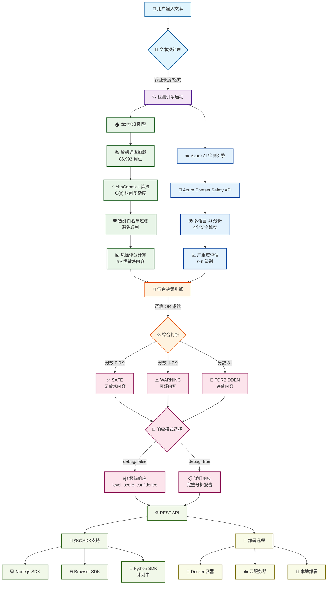

# 🏗️ 敏感词检测框架 - 技术架构流程图

## 📋 系统概览

**敏感词检测框架**是一个企业级、高性能的内容安全检测系统，采用**本地+云端混合检测**策略，为开发者提供完整的敏感内容识别解决方案。

## 🔄 技术流程图



## 🎯 核心技术模块

### 1. **输入处理层**
- **文本预处理**: 格式验证、长度检查（最大10,000字符）
- **编码标准化**: UTF-8统一处理
- **输入清理**: 特殊字符处理

### 2. **双引擎检测层**

#### 🏠 本地检测引擎
```
📚 敏感词库
├── 86,992 总词汇量
├── 51,308 去重词汇
├── 16个分类词库文件
└── 5大敏感内容类别
```

**检测算法**:
- **AhoCorasick 自动机**: O(n) 时间复杂度
- **智能白名单**: 35+常用词汇避免误判
- **风险评分**: 基于词汇类型和频次

#### ☁️ Azure AI 检测引擎
```
🤖 Azure Content Safety
├── 多语言AI语义分析
├── 4个安全维度检测
│   ├── Hate (仇恨言论)
│   ├── Violence (暴力内容)
│   ├── Sexual (性相关)
│   └── SelfHarm (自伤)
└── 0-6级严重度评估
```

### 3. **混合决策引擎**

#### 🏠 本地检测判断逻辑

**🚫 Forbidden (严重违禁) 条件** - 任一条件满足即为 forbidden：

1. **直接粗俗辱骂** (`analysis.curseWords = true`)
   - 如：操你妈、傻逼、滚你妈的蛋等
   - 风险分数：+10分

2. **政治敏感内容** (`analysis.politicalSensitive = true`)
   - 如：习近平是独裁、推翻共产党、一党专制等
   - 风险分数：+8分

3. **暴力威胁** (`analysis.violenceThreat = true`)
   - 如：我要杀了你、炸掉这个地方、血洗等
   - 风险分数：+9分

4. **累积风险分数 ≥ 8**
   - 包括种族歧视 (+8分)、极端言论 (+9分)
   - 政治/暴恐词库匹配 (+3分/词)

**⚠️ Warning (可疑内容) 条件** - 当不满足 forbidden 条件时：

1. **风险分数 ≥ 2**
   - 理由：`可疑内容 (风险分数: X, 匹配词汇: X)`
   - 置信度：0.75

2. **风险分数 ≥ 1**
   - 理由：`轻度敏感内容`
   - 置信度：0.65

**✅ Safe (安全内容)**
- **风险分数 < 1**
- 理由：`无敏感内容`
- 置信度：0.95

#### 📊 风险分数累积规则

```typescript
// 高风险类别
直接粗俗辱骂: +10分
暴力威胁: +9分
极端言论: +9分
政治敏感: +8分
种族歧视: +8分

// 词库匹配
政治类型/反动词库: +3分/词
暴恐词库/涉枪涉爆: +3分/词
其他敏感词: +1分/词 (单字符降权至0.2分)

// 警告级别
警告关键词: +0.5分/词
```

#### ⚖️ 混合决策逻辑

```
⚖️ 决策逻辑: 严格 OR 策略
├── 本地检测 = 危险 → 结果 = 危险
├── Azure检测 = 危险 → 结果 = 危险
├── 双方都安全 → 结果 = 安全
└── 最大化检测覆盖率，最小化漏检
```

**核心原则：严重类别直接触发 forbidden，累积分数决定最终级别**

### 4. **结果分级系统**
| 级别            | 分数范围  | 描述       | 建议处理 |
| --------------- | --------- | ---------- | -------- |
| 🟢 **SAFE**      | 0 - 0.9   | 无敏感内容 | 直接通过 |
| 🟡 **WARNING**   | 1.0 - 7.9 | 可疑内容   | 人工审核 |
| 🔴 **FORBIDDEN** | 8.0+      | 违禁内容   | 直接拦截 |

### 5. **双响应模式**

#### 📦 极简模式 (默认)
```json
{
  "success": true,
  "level": "safe",
  "score": 0,
  "confidence": 0.95,
  "meta": {
    "timestamp": "2025-01-01T12:00:00Z",
    "processingTime": 2,
    "version": "1.0.0"
  }
}
```

#### 📋 详细模式 (debug: true)
```json
{
  "success": true,
  "result": {
    "level": "safe",
    "reason": "详细检测说明",
    "confidence": 0.95,
    "details": {
      "local": { /* 本地检测详情 */ },
      "azure": { /* Azure检测详情 */ },
      "finalDecision": { /* 决策逻辑 */ }
    }
  },
  "meta": { /* 元数据 */ }
}
```

## 📊 性能指标

| 指标         | 本地检测  | Azure检测 | 混合检测    |
| ------------ | --------- | --------- | ----------- |
| **响应时间** | 1-3ms     | 50-200ms  | 50-300ms    |
| **并发处理** | 1000+ QPS | 100+ QPS  | 100+ QPS    |
| **准确率**   | 95%+      | 98%+      | 99%+        |
| **语言支持** | 中文      | 多语言    | 中文+多语言 |

## 🚀 技术栈

### 核心技术
- **Runtime**: Bun (高性能JavaScript运行时)
- **语言**: TypeScript (类型安全)
- **算法**: AhoCorasick自动机
- **AI服务**: Azure Content Safety

### API & SDK
- **API框架**: Bun.serve (原生HTTP服务)
- **SDK语言**: TypeScript (Node.js + Browser)
- **未来支持**: Python SDK

### 部署 & DevOps
- **容器化**: Docker + Docker Compose
- **配置管理**: 环境变量 + .env文件
- **监控**: 健康检查 + 统计接口

## 🎯 应用场景

### 1. **内容审核平台**
```typescript
// 实时内容过滤
const result = await client.detect(userContent);
if (result.level === 'forbidden') {
  return '内容违规，请修改后重试';
}
```

### 2. **社交媒体应用**
```typescript
// 批量消息检测
const messages = ['消息1', '消息2', '消息3'];
const results = await client.detectBatch(messages);
```

### 3. **论坛系统**
```typescript
// 帖子评论审核
const post = await client.detect(postContent, true); // 详细模式
if (post.result.level !== 'safe') {
  logAuditResult(post.result.details);
}
```

### 4. **企业文档扫描**
```typescript
// 文档安全扫描
const documents = await scanDocuments();
const risks = documents.filter(doc =>
  doc.result.level === 'forbidden'
);
```

## 🔧 快速开始

### 1. **部署API服务**
```bash
# Docker方式
docker run -p 3000:3000 \
  -e AZURE_CONTENT_MODERATOR_ENDPOINT="your-endpoint" \
  -e AZURE_CONTENT_MODERATOR_KEY="your-key" \
  sensitive-word-api

# 或者直接运行
bun install
bun run dev
```

### 2. **使用SDK**
```typescript
import { SensitiveWordClient } from 'sensitive-word-sdk';

const client = new SensitiveWordClient({
  baseURL: 'http://localhost:3000'
});

// 简单检测
const result = await client.detect('测试文本');
console.log(result.level); // 'safe' | 'warning' | 'forbidden'

// 详细检测
const detailed = await client.detect('测试文本', true);
console.log(detailed.result.details);
```

### 3. **REST API调用**
```bash
# 极简模式
curl -X POST http://localhost:3000/api/detect \
  -H "Content-Type: application/json" \
  -d '{"text":"测试内容"}'

# 详细模式
curl -X POST http://localhost:3000/api/detect \
  -H "Content-Type: application/json" \
  -d '{"text":"测试内容","debug":true}'
```

## 📈 发展路线图

### ✅ 已完成
- [x] 双引擎混合检测架构
- [x] TypeScript SDK (Node.js + Browser)
- [x] REST API 与双响应模式
- [x] Docker 容器化部署
- [x] 完整文档和示例

### 🚧 开发中
- [ ] Python SDK
- [ ] 性能监控面板
- [ ] 自定义词库管理
- [ ] 批量文件检测

### 🎯 未来计划
- [ ] Go/Java SDK
- [ ] 机器学习模型集成
- [ ] 图片/视频内容检测
- [ ] 企业级管理后台

## 📞 技术支持

- **文档**: [API文档](./API.md)
- **示例**: [SDK使用示例](../examples/)
- **源码**: [GitHub仓库](https://github.com/your-repo/sensitive-word-check)
- **问题反馈**: [Issues](https://github.com/your-repo/sensitive-word-check/issues)

---

**© 2025 敏感词检测框架 - 企业级内容安全解决方案**